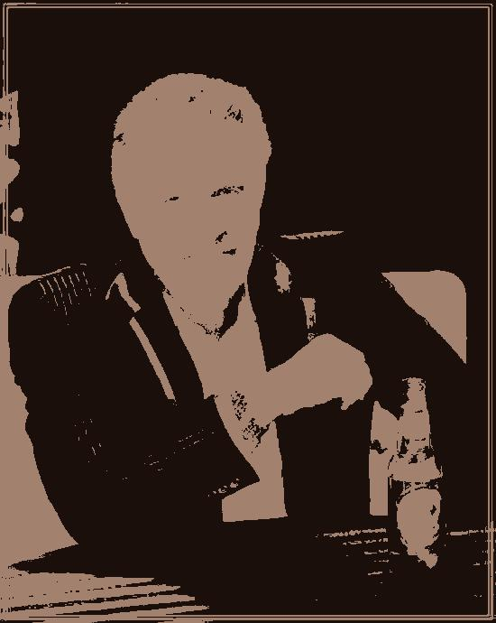
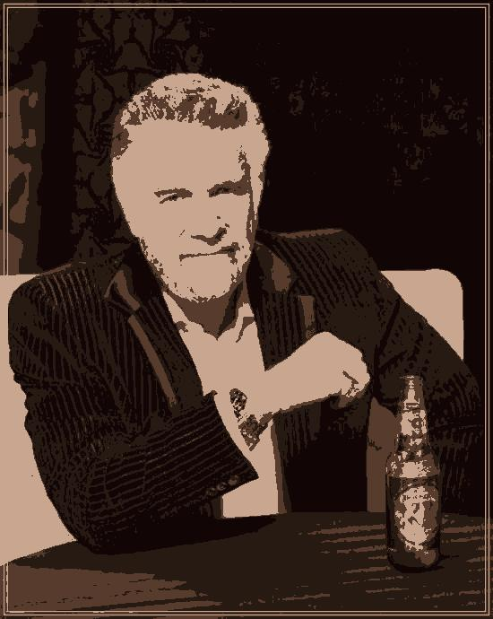
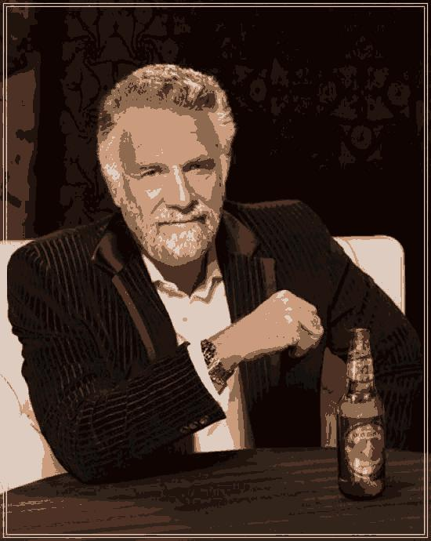

# Expectation-Maximization-Machine-Learning-Algorithm
 
This is our original photo before applying our Expectation Maximization Algorithm:

We test our algorithm using a variety of K values (1,2,4,8,16,32,64).
The total runtime for the rendering and for the algorithm to complete all iterations (if needed) was 48'.

Below we see a side by side comparison of the results for each value of K.
For the value of K=64 we notice that the algorithm has come quite close to immitating the image.

K=1:

  
   

K=2:

  
   

K=4:

  
   

K=8:

  
   

K=16:

  
   

K=32:

  
   

K=64:

  
   

